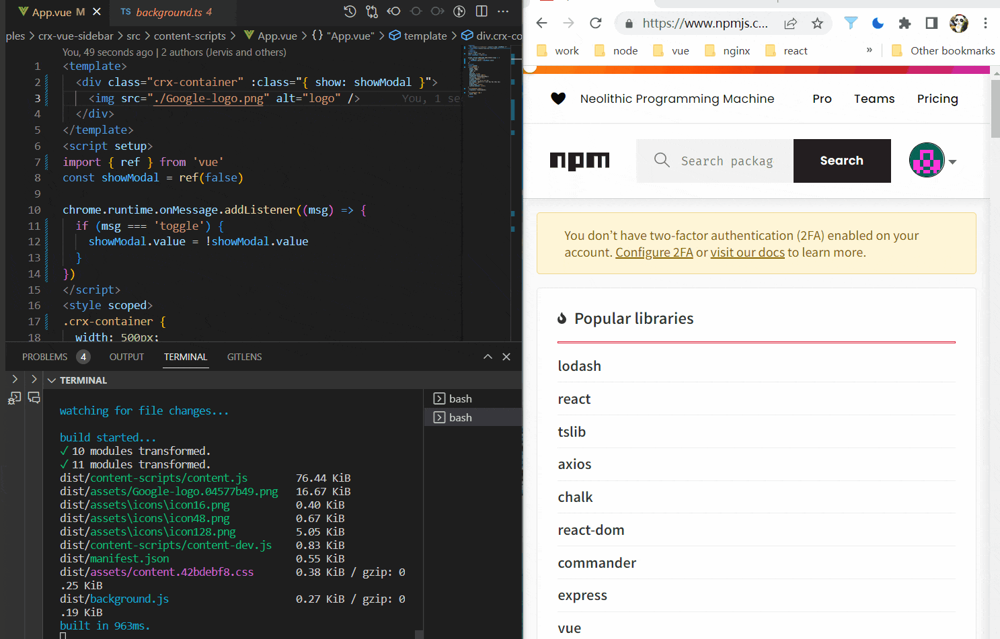

# vite-plugin-crx-mv3

> Build a Chrome Extension with Vite.

**English** | [简体中文](./README.zh_CN.md)

## Features

+ Support Manifest V3.
+ Support Typescript.
+ Support sass/less in manifest.json.
+ Support for multiple frameworks or libraries, such as vue, react, etc.
+ Live Reload
+ Easy to get started

## Usage
### Install

```bash
# npm
npm install vite-plugin-crx-mv3 -D
# or yarn
yarn add vite-plugin-crx-mv3 -D
# or pnpm
pnpm add vite-plugin-crx-mv3 -D
```
### Plugin options

#### port

- **Type:** `number`
- **Default:** `8181`

Create a websocket connection. Notify Chrome extension clients to reload when changes are made to the content_scripts and service_worker files.

#### manifest

- **Type:** `string`
- **Required :** `true`

Path to the chrome extension's manifest.json

#### reloadPage

- **Type:** `blooen`
- **Default :** `true`

Control automatic page loading in dev environment

### Configuration

```js
import { defineConfig } from 'vite'
import vue from '@vitejs/plugin-vue'
import crx from 'vite-plugin-crx-mv3'

export default defineConfig({
  plugins: [
    vue(),
    crx({
      manifest: './src/manifest.json'
    }),
  ],
})
```

### Run

```bash
# development
npm run dev
# production
npm run build
```

## Examples
Check out the examples in this repo.

+ crx-basic
+ crx-vue
+ crx-vue-drawer
+ crx-vue-multi-page
+ crx-vue-antd-bookmarks
+ crx-react
+ crx-react-sandbox
+ crx-solid
+ crx-newtab
+ crx-contentscript-sass-less
+ crx-chrome.script
+ crx-i18n
+ crx-devtools
+ crx-webAccessibleResources

## Preview
> examples/crx-vue-drawer



## Notes
+ After starting the project, you need to refresh the page manually for the first time, so that the client and the server can establish a websocket connection.
+ The html file needs to be placed outside the src directory.
