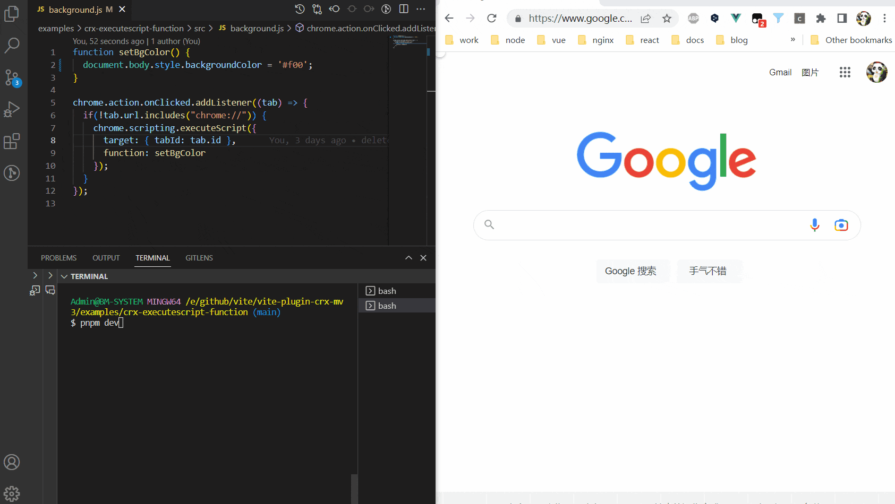

# vite-plugin-crx-mv3

> 使用 Vite 构建 Chrome 扩展

[English](./README.md) | **简体中文** 

## 特性

+ 支持Manifest V3
+ 支持Typescript
+ 支持在manifest.json中配置sass/less
+ 支持多种框架或库，如vue，react等等
+ 在开发模式中，修改文件后Chrome扩展自动重载
+ 配置简单，开发体验好

## 用法

### 安装

```bash
# npm
npm install vite-plugin-crx-mv3 -D
# or yarn
yarn add vite-plugin-crx-mv3 -D
# or pnpm
pnpm add vite-plugin-crx-mv3 -D
```

### 插件选项

#### port

- **Type:** `number`
- **Default:** `8181`

建立一个websocket连接。在content_scripts和service_worker文件发生变化时，通知Chrome扩展客户端重载。

#### manifest

- **Type:** `string`
- **Required :** `true`

Chrome扩展的manifest.json文件路径。

### 配置
```js
import { defineConfig } from 'vite'
import vue from '@vitejs/plugin-vue'
import crx from 'vite-plugin-crx-mv3'

export default defineConfig({
  plugins: [
    vue(),
    crx({
      manifest: './src/manifest.json'
    }),
  ],
})
```

### 运行
```bash
# development
npm run dev 
# production
npm run build
```

## 例子
在本仓库下的examples目录下：

+ crx-basic
+ crx-vue
+ crx-vue-drawer
+ crx-vue-multi-page
+ crx-vue-antd-newtab
+ crx-vue-antd-bookmarks
+ crx-react
+ crx-react-sandbox
+ crx-solid
+ crx-contentscript-sass-less
+ crx-executescript-function
+ crx-executescript-files
+ crx-insertcss-files
+ crx-devtools

## 预览

> examples/crx-executescript-function



> examples/crx-vue-drawer


## 注意事项
+ 启动项目后，第一次需要手动刷新页面，这样客户端和服务端便建立了websocket连接。
+ html文件需要放在src目录外层。
